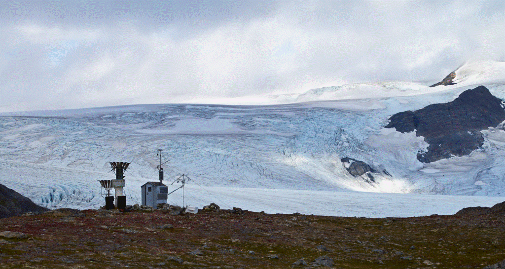

# Topoflow-glacier

<figure>
  
  <figcaption><strong>Figure 1.</strong> Wolverine glacier weather station, Alaska.</figcaption>
</figure>

## Running the glacier module from topoflow

### Getting Started
This repo is managed through [UV](https://docs.astral.sh/uv/getting-started/installation/) and can be installed through:
```sh
uv sync
```

Once the venv is installed, examples can be run through
```sh
uv run python examples/run_topoflow_glacier.py
```

### Development
To ensure that topoflow-glacier code changes follow the specified structure, be sure to install the local dev dependencies and run `pre-commit install`

### Tests
To run all tests, run
```sh
uv sync --all-extras
uv run pytest
```

### Documentation
To build the user guide documentation for topoflow-glacier locally, run the following commands:
```sh
uv pip install ".[docs]"
mkdocs serve -a localhost:8080
```
Docs will be spun up at localhost:8080/
